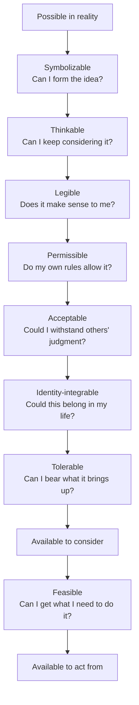

When you feel stuck, it usually seems as though you have already considered every reasonable option. You keep returning to the same few choices, and each one has a familiar reason it will not work. Other people may leave the job, ask for help, set a boundary, or begin again. You can see how those choices work for them. In your own life, they feel wrong or unrealistic. Perhaps you could do the same if you had more resources or more charisma. Given who you are and what you have, the situation appears settled.

What you cannot see from inside that experience is the option you have never learned how to consider. It does not feel hidden. It simply does not occur to you, or it passes through your mind so quickly that you dismiss it before thinking it through. Only later, after something has changed, do you look back and wonder why the answer once seemed impossible.

Your **consideration space** is the set of possibilities you can take seriously in your own life.

When that range is narrow, life feels narrow. The feeling is real even when more options exist in theory. Telling yourself to “think bigger” rarely helps, because you cannot force yourself to see what you do not yet know how to see.

## What consideration space includes

An option can exist in reality and still fall outside what you can take seriously for yourself.

You may discover a new explanation for why a friendship changed, then realize that a conversation you had ruled out might be worth having. You may admit that you want a different kind of life before you know what to do about it. You may begin to imagine yourself as someone who asks for care instead of waiting until care is unavoidable. None of these changes is an action, yet each one changes which actions make sense.

These changes matter because we can choose only among the options we can seriously consider. Most advice about decision-making assumes that the relevant choices are already visible. The earlier question is why some choices become available while others do not.

This is why two people in similar circumstances can see very different choices. One employee may think the only options are to endure a job or quit without a plan. Another may consider reducing their hours, changing responsibilities, or taking a leave. The difference may have little to do with intelligence. One person has access to possibilities the other has not yet found, understood, or allowed.

A group can overlook an option just as easily as an individual. Two roommates may keep arguing about cleaning because they have considered only reminders and stricter schedules. They may not realize that they could divide the work according to which tasks each person minds least. Once someone suggests that arrangement, the roommates have a way to address the work itself instead of repeating the same argument.

Growth does not always mean making a wiser choice from the same list. Sometimes it means becoming able to consider something that previously felt irrelevant, unacceptable, or impossible.

## Eight gates from possibility to action

An option may remain unavailable for consideration or unusable in action for at least eight different reasons. These gates are a working model, not a rigid account of how thought proceeds. Several may matter at once.

### Representation: forming and understanding the option

An option is **symbolizable** when you can give it some form in your mind. You might have words for it, a clear image, or only a bodily sense that life could be different. Without any form at all, there is nothing to examine.

An option is **thinkable** when you can hold it in mind without cancelling it immediately. Someone might briefly think, *I could say no to this family obligation*, then answer themselves with *No, I couldn't*. They applied the rule so quickly that they never had a chance to consider saying no.

An option is **legible** when it makes sense within your understanding of the world. A volunteer collective may know that its meetings are exhausting while assuming that structure would make the group hierarchical. A rotating facilitator will sound wrong until the members understand that rigorous coordination can still feel informal and equal. Once they understand the difference, they can consider a form of coordination that previously made no sense to them.

Respond according to what happened. An option without form needs an example or words. If the mind dismisses it immediately, it needs time before judgment. If it seems incoherent, the person needs a better explanation of how it could work.

### Permission and identity

An option is **permissible** when it does not violate one of your internal rules. A person may know that rest would help and still believe that resting before the work is finished is lazy. The obstacle is not a missing plan. It is a moral rule about what they are allowed to need.

An option is **acceptable** when you believe it can survive other people's judgment. A junior colleague may have a useful suggestion but expect that raising it will make them seem difficult. No formal rule prevents them from speaking. They stay quiet because they expect a social cost.

An option is **identity-integrable** when you can imagine it as part of your own life. The dependable friend may admire people who ask for help and trust that their friends would respond kindly. Yet asking still feels like something *they* would not do. To make the option available, they need a version of reliability that includes asking before they collapse.

A person may experience all three gates as the same conclusion: *that is not for me*. The source may be an internal rule, expected judgment, or the limits of a familiar identity. Knowing which one is active tells you what needs to change.

### Tolerability and feasibility

An option is **tolerable** when you can stay present with the feelings it brings up. A direct conversation with a partner may be reasonable and allowed, but the prospect of conflict may be so overwhelming that avoidance feels like the only choice. In that case, the person may already know what to do. They need a smaller emotional step, perhaps rehearsing the first sentence or choosing a calmer setting.

The first seven gates determine whether you can seriously consider an option. **Feasibility** determines whether you can act from it under present conditions. A person may know exactly how to leave a job but lack the savings to do so safely. A neighborhood group may have willing members but no clear way to hand off responsibility. In both cases, the option is available for consideration while something required for action is still missing.

A concrete first step can make change less frightening. Feeling calmer can also make it easier to identify what the next step requires. Tolerability and feasibility are different, but progress in one can improve the other.

## Why options go missing

People do not usually exclude options on purpose. The limits come from temperament, experience, and present circumstances.

Some people notice risk quickly and are slow to trust what is unfamiliar. Others are more comfortable with uncertainty. As a result, people pay attention to different ideas before making any conscious judgment.

Through experience, people learn what is safe to want. A child who is punished for disagreement may grow into an adult who rarely thinks of objecting. Someone who received affection mainly for being useful may find it almost impossible to ask for care. The lesson can become so familiar that it feels like personality rather than memory.

Families and cultures reinforce these lessons by showing us what a respectable life looks like. They teach who may lead, what can be refused, and which desires deserve to be taken seriously. A choice can be common in one social world and almost unimaginable in another.

Present circumstances also matter. Exhaustion can make an ordinary conversation feel impossible. Financial pressure can make an otherwise sensible experiment reckless. Sometimes the option is missing because the person is protecting themselves from an old danger. Sometimes the danger is current and should be respected.

Instead of demanding a larger imagination, ask what would become risky if the missing option were taken seriously. Would it threaten belonging? Would it expose a need you have survived by denying? Would it create a responsibility you cannot carry yet? Once you name the risk, you can see why you excluded the option and what would make it safer to reconsider.

## Exploration

You discover more options by encountering lives and ideas beyond the ones you already know.

Other people can provide the first credible example. Meeting a parent who receives help without apology may make support easier to picture. Watching a community share leadership while still making clear decisions shows that hierarchy and chaos are not the only choices. An example is most useful when it is close enough to feel possible, not so exceptional that it can be dismissed.

You can also learn by running a small experiment. Someone who longs for more creative time does not have to decide immediately whether to change careers. Protecting one afternoon for neglected work may reveal whether doing the work brings satisfaction or only relief from the usual routine. That experience provides information that fantasy and self-argument cannot.

It is easier to explore once curiosity no longer feels like commitment. You can consider a desire without promising to pursue it. You can test an interpretation without declaring it true. When attention no longer creates an obligation, people can notice what they had been suppressing.

Treating every new idea as revelation creates confusion rather than freedom. A new idea becomes useful when you can examine and test it.

## Discernment

Before responding to a limit, identify what kind of limit it is.

The sentence *I can't* can mean several different things:

- No workable path exists under the present conditions.
- The path exists, but the cost is not worth paying.
- A path may exist, but I do not know it yet.
- The path violates a rule I have never examined.

The first claim says that no workable path exists now. None of the four claims proves that a path will always be impossible. The others identify a cost, a gap in knowledge, or a hidden prohibition.

Suppose two friends have grown distant. *We cannot repair this* may be an accurate reading if one person has refused further contact. It may also spare the other person from risking an apology or hearing no. Looking at what has actually happened separates a closed relationship from a frightening conversation that has not yet been attempted.

A person has crossed from hope into fantasy when contrary evidence no longer matters. Ask what you have tested and what you have merely assumed. Notice what evidence would change your mind. The goal is not to keep every option open. It is to avoid settling the question out of fear or wishful thinking before you know what is true.

## Regulation

You need enough steadiness to remain with an unfamiliar option while you decide what it means.

A new direction may feel obvious one day and impossible the next. Feeling differently the next day does not prove that the insight was false. You may simply have felt more uncertainty than you could hold at once.

Change is easier to absorb when it happens at a manageable pace. Reduce the surrounding strain before testing a difficult possibility. Keep one familiar routine while trying one new thing. Fear may mean that the step is too large, or it may warn of a real danger. Check the conditions before deciding which.

Considering an option is not the same as committing to it. Thinking seriously about leaving does not require leaving. Admitting a desire does not require reorganizing your life around it. You are allowed to examine an option and decide against it.

Moving too fast creates a different problem. You may choose something mainly to prove that you are no longer the person who felt trapped. Once you no longer need to use the choice as proof that you have changed, you can judge whether it actually suits you.

## Attachment and aversion

A person becomes attached when one version of a desired future starts to feel like the only acceptable version. Someone who wants creative freedom may decide that only a certain job will provide it. Other routes then look like compromises even when they serve the underlying desire more directly.

A person acts from aversion when they stop considering an option because of what it would require. They may want intimacy while avoiding the dependence that intimacy permits. A consensus-led group may want broader participation while resisting the structure needed to stop its loudest members from dominating. Until enough structure feels acceptable, the group cannot prevent informal power from concentrating among the people who already speak most.

This is why wanting something intensely does not guarantee that you can consider receiving it. Ask what would have to change in you if the desire were fulfilled. You may discover a consequence you have been avoiding or realize that you mistook one form for the desire itself.

Imagination cannot command an outcome. It can help a person recognize and cooperate with a possibility that once felt unavailable. When they can also bear its consequences and organize their life around it, they are more able to help realize, sustain, or receive it. In manifestation practice, letting go means releasing one rigid picture of fulfillment while remaining faithful to the deeper desire.

## A practical diagnostic

Choose one recent moment when your response felt inevitable. Work from what you could see at the time, not the options that became obvious afterward.

1. **Reconstruct the choice.** Write down what you genuinely believed you could do. Include the explanation that made those choices seem exhaustive.
2. **Name one absent option.** Choose something that was unavailable then but now seems at least conceivable, even if you still would not choose it.
3. **Check every gate as it operated then.** Return to what you believed and felt in the remembered moment. More than one gate may have kept the option unavailable.
4. **Ask what the gate protects.** Complete a sentence such as *People like me do not...* or *If this worked, I would have to...* The answer may reveal a rule you have mistaken for a fact.
5. **Build a small test.** Choose an action that produces new information without requiring a permanent commitment.

Match the test to the gate:

| Gate | Useful response |
| --- | --- |
| Symbolizable | Find language or a nearby example. |
| Thinkable | Give the idea time before judging it. |
| Legible | Learn how the option could work. |
| Permissible | Examine the rule that forbids it. |
| Acceptable | Test your prediction with a safer audience. |
| Identity-integrable | Imagine the nearest version that still feels like you. |
| Tolerable | Make the emotional step smaller. |
| Feasible | Identify what is missing and whether it can be obtained. |

Observe what actually happens. If someone refuses, you have found a genuine limit. If you feel relief, the danger you anticipated may have passed. If a different discomfort appears, check the next gate. The purpose of the test is not to prove that every limit is imaginary. It is to replace inevitability with information.

## What growth changes

A mature consideration space is not an endless supply of options. Too many choices can make action harder. The aim is to see enough possibilities to choose deliberately while respecting their consequences.

With practice, you become better able to distinguish inherited rules from facts. You notice alternatives before a crisis forces you to find them. You can approach an unfamiliar desire without obeying it, and protect what matters without making your current identity a prison.

Choice is only the final moment. We gain or lose much of our freedom earlier, depending on whether we can imagine an option, understand it, allow it, and bear what it brings up. When more options become available before the decision, we have more of reality to choose from.
