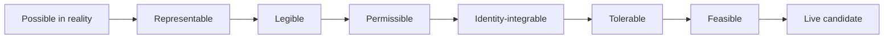

People often feel trapped even when options objectively exist. The limiting factor is not always reality itself. It is often the range of possibilities the mind can generate, admit, hold, and act from.

That range is your **consideration space**.

Consideration space is the internal field of live candidates: possible actions, interpretations, identities, beliefs, strategies, relationships, and futures that feel real enough to engage. Many things that could matter never enter this field. They remain unimagined, illegible, disallowed, emotionally unbearable, or too vague to enact.

Consideration space is a practical working model, not an exhaustive account of how possibility is formed.

This changes the shape of growth. Choosing well matters, but choice only works on the options already present. Sometimes the deeper work is to change which options can appear, survive contact with the self, and become usable.

**Growth consists in improving consideration space: making it wider, clearer, and more inhabitable.**

Three capacities make that possible:

1. **Explore** to discover and admit more possibilities.
2. **See clearly** to distinguish reality from fear, fixation, inheritance, and fantasy.
3. **Contain and regulate** to remain coherent while the field expands.

The aim is not endless openness. A field with no boundaries becomes noise. The aim is a consideration space broad enough for novelty, precise enough for discernment, and stable enough to support action.

## What consideration space contains

External options and live options are different things.

An action may be physically possible while remaining absent from consideration because you cannot imagine it clearly. You may be able to imagine it but experience it as forbidden. It may feel permissible for other people but incompatible with who you are. You may want it and still be unable to tolerate the uncertainty, conflict, visibility, grief, or responsibility it would bring.

This is why two people can share similar conditions and inhabit radically different worlds. One sees a single path. Another sees ten. One cannot imagine leaving; another cannot imagine staying. One interprets a setback as final proof. Another sees information, tradeoffs, and several possible experiments.

Reality may be shared. The field of live possibility is not.

Consideration space also includes more than action. A new interpretation can enter before a new behavior does. A different identity may become imaginable before it feels inhabitable. A desire can become honest before it becomes feasible. The field contains anything the system can hold as a meaningful candidate rather than immediately deleting, dismissing, or fleeing.

This gives us a more precise account of freedom:

> Freedom depends on more than the presence of options. It requires access to them as live possibilities.

## How a possibility becomes live

A possibility has to pass through several gates before it can participate in choice. These gates are related, but they do different work.

### Representational gates

A possibility first needs an internal form.

**Symbolizable** means it can be represented in language, image, felt sense, or narrative. Some possibilities never become stable enough to think about. Rest, leadership, refusal, receiving, intimacy, or leaving may produce only fog, absurdity, or a blank space.

**Thinkable** means the possibility can remain present without being instantly cancelled by taboo or contradiction. A thought may flash into awareness and immediately meet, “That is ridiculous,” “That is impossible,” or “Life does not work that way.”

**Legible** means the move makes enough sense within your model of reality to count as coherent. You can understand what it is, why someone might do it, and how it could relate to the situation.

### Normative and identity gates

Once a possibility can be represented, it still has to become licit.

**Permissible** means it is not blocked by an internalized rule. The rule may be moral, familial, cultural, professional, or spiritual.

**Acceptable** means the possibility can survive anticipated judgment from people or groups who matter. A move can feel personally valid and still seem socially impossible.

**Identity-integrable** means it can fit within your current self, or within a version of you that can be reached without fragmentation. Growth does not require every new possibility to match who you are now. It does require enough continuity for a larger identity to become inhabitable.

### Regulatory and practical gates

A possibility finally needs to become livable.

**Tolerable** means you can bear the states that come with considering or enacting it. This is one of the most underestimated gates. The action itself may be available; the exposure, shame, uncertainty, conflict, success, or self-revision around it may not be.

**Feasible** means there is an executable path, at least in part, given your present skills, means, timing, and conditions.

The gates are not a rigid sequence. They can affect one another in both directions. A small practical script can make an option feel more tolerable. Meeting someone who has already made a similar move can make it more legible and identity-compatible. Greater emotional capacity can allow the mind to represent something it previously kept vague.

The model is useful because it replaces the undifferentiated statement “I am blocked” with a better question:

**At which gate does this possibility disappear?**

## Why consideration space contracts

A narrow consideration space is often an adaptation before it becomes a limitation.

Living systems cannot keep every possibility open. They have to prune, compress, stabilize, and protect themselves from overload. A person who learned that dissent led to punishment may stop generating confrontation as an option. Someone whose belonging depended on usefulness may find rest morally illegible. A painful experience can cause the mind to exclude a whole family of related possibilities before conscious evaluation begins.

Several layers can shape the field at once:

- **Biological disposition** can influence sensitivity to novelty, threat, disgust, status, and uncertainty.
- **Developmental learning** teaches what can be wanted, expressed, refused, risked, or received.
- **Social worlds** establish a local field of the thinkable through family, class, profession, religion, and subculture.
- **Identity** carries an implicit grammar: people like me do not do that; good people do not want that; strong people do not need help.
- **Regulation** excludes possibilities whose emotional or bodily cost exceeds current capacity.
- **Traumatic learning** can associate entire categories of action, relationship, or self-expression with danger.

This is why “think bigger” so often fails. What appears to be a shortage of imagination may be a structure of protection.

Hostile self-judgment usually tightens that structure. A more useful stance begins with respect for its original function:

*What did this narrowing protect? Does it still need to protect me in the same way now?*

That question creates room for change without demanding that the system betray the intelligence that kept it intact.

## The three capacities that improve consideration space

Improving consideration space requires expansion, discrimination, and coherence. Each capacity corrects a different failure, and each becomes distorted without the other two.

### Explore to widen the field

Exploration increases the range of possibilities that can be generated and admitted.

New environments, disciplines, relationships, stories, role models, and experiments can all enlarge what the mind knows how to form. Exploration also happens internally when you try on a new interpretation, question an inherited rule, imagine a different identity, or ask what you would want if no answer had to become a commitment.

The point is to become less falsely small.

Exploration without discernment can become intoxication. The person collects possibilities, identities, and visions while remaining thin in judgment and execution. Useful expansion makes new candidates available for honest contact while staying answerable to reality.

### See clearly to reveal the field’s real shape

Clear seeing improves discrimination. It asks what is real, inherited, feared, projected, desired, avoided, costly, or simply unknown.

One of its most important moves is separating prohibition from impossibility. These statements feel similar from inside a contracted field:

- I am not allowed.
- I am afraid.
- This would cost me.
- This would change how people see me.
- I do not yet know how.
- This is impossible.

They describe different conditions. Only the last one claims that no path exists. When they collapse into a single feeling of “cannot,” the geometry of the situation disappears.

Clarity also protects expansion from wishful thinking. Some paths really are unavailable. Some are available but unwise. Some are desirable but not yet stable. Some are seductive because they preserve an attachment rather than meeting the underlying need.

Seeing clearly does not shrink the field. It lets you perceive its actual contours.

### Contain and regulate to inhabit the field

Containment means boundedness, continuity, and the ability to remain usable while complexity increases.

A widened consideration space can be destabilizing. Novelty becomes noise. Inspiration becomes fragmentation. A person glimpses a larger life, then recoils into old certainty because the new field demands more uncertainty or identity change than the system can hold.

Regulation makes expansion inhabitable through pacing, prioritization, emotional capacity, routines, sequencing, and limits on how many experiments are active at once. It gives a new possibility enough continuity to survive beyond the moment of insight.

It also protects a crucial distinction:

> Allowing a possibility into consideration does not create an obligation to choose it.

Every new option can feel like pressure when openness and commitment are confused. A mature field allows you to consider, test, refuse, delay, and sequence. Freedom includes the ability to stay in contact with a possibility without obeying it.

## How attachment and aversion distort the field

Attachment and aversion are two powerful ways consideration space loses its shape.

Attachment collapses the field onto one privileged image, route, proof, or timeline. The person may remain highly motivated, but flexibility and perception weaken. Only one form of the desired future counts, so adjacent possibilities become invisible.

Aversion censors possibilities whose consequences threaten the current self. A person may consciously want intimacy while rejecting dependence, want success while rejecting visibility, want freedom while rejecting uncertainty, or want truth while rejecting the identity change that truth would require.

Many blocks are therefore not failures of desire. They are failures of admissibility.

The deeper question is often not, “Can I imagine getting what I want?” It is, “Can I metabolize what would become true if I received it?”

This is also the most grounded way to work with manifestation. Reality does not become obedient to thought. What you can imagine, admit, emotionally tolerate, and behaviorally organize around can become more causally active in your life. It changes what you notice, attempt, practice, communicate, persist with, and become able to receive.

At its best, letting go does not mean abandoning desire. It means releasing the rigidity that forces desire into one overinvested form.

## How to diagnose a contracted field

When you feel stuck, begin one level below “What should I do?”

Ask:

**What is absent from consideration?**

Then locate the gate:

| If the option is… | The likely bottleneck is… | A useful next move is… |
|---|---|---|
| impossible to picture or name | representation | Find language, stories, or examples that give it form. |
| imaginable but incoherent | legibility | Learn how the path works and what conditions it requires. |
| coherent but forbidden | permissibility | Surface the rule and ask whose rule it is serving. |
| acceptable for others, not for you | identity integration | Find an adjacent version of self that can take one step toward it. |
| desirable but overwhelming | tolerability | Reduce the dose and build capacity for the state it evokes. |
| emotionally available but vague | feasibility | Add a script, sequence, resource, or small experiment. |

The categories can overlap. The purpose is not perfect classification. It is to replace a global judgment about the self with a specific place where movement can begin.

## A practical method for expanding the field

Choose one situation where your behavior feels repetitive, constricted, or strangely inevitable.

### 1. Map the live options

Write down what genuinely felt available in that moment, not what you believe should have been available afterward.

What could you imagine doing? Which interpretations felt true? What futures appeared to follow? What kind of person did the situation require you to remain?

This reveals the field you were actually choosing from.

### 2. Separate impossible from disallowed

Take one missing option and ask what made it unavailable.

Was it physically impossible, strategically unwise, emotionally costly, socially risky, morally prohibited, identity-threatening, procedurally unclear, or merely unfamiliar?

Do not flatten these into one category. Each condition implies a different intervention.

### 3. Surface the hidden grammar

Complete a few sentences without trying to make the answers reasonable:

- I am not allowed to…
- People like me do not…
- If I became able to do this, it would mean…
- The worst part of receiving this would be…
- If this actually worked, I would have to…

The answers expose rules that normally operate as reality rather than as interpretations.

### 4. Recruit adjacent proof

Radical exemplars can inspire, but they can also feel too distant to become usable. Look for nearby people, stories, or experiments that make the possibility slightly more legible.

The most effective proof is often not “someone achieved the final form.” It is “someone sufficiently like me took the next step and remained intact.”

### 5. Increase tolerability and add a script

If the option is visible but unbearable, shrink the dose. Practice the uncertainty, boundary, visibility, request, refusal, or conflict in a reversible form.

If the option feels emotionally possible but procedurally empty, give it a script. Draft the sentence. Find the application. Price the experiment. Identify the first ten minutes. Ask someone how the process actually works.

Many possibilities do not need more belief. They need a bridge between admissibility and action.

### 6. Let reality answer

Run the smallest meaningful experiment and observe what happens.

The purpose is not to prove that the desired option was secretly available all along. The experiment may reveal a real constraint, a hidden cost, a better route, or a mistaken desire. Consideration space improves when it becomes more answerable to reality, not simply larger.

## A daily practice

At the end of the day, choose one moment when you felt stuck, avoidant, reactive, or mechanical.

Ask:

1. What options felt live?
2. What options were absent?
3. Which gate did the narrowing happen at?
4. What was the narrowing trying to protect?
5. What would one slightly larger field have contained?
6. Could I have stayed regulated enough to hold it?

This takes only a few minutes. Over time, it trains attention toward the architecture underneath repeated choices.

If the reflection creates more activation than curiosity, pause. Choose a smaller possibility, return when you feel more settled, or work through it with someone you trust.

## Growth changes the field from which choice arises

Life asks us to make better decisions and to become the kind of systems that can consider more of what is real without becoming lost in it.

Explore enough to widen the field. See clearly enough to distinguish possibility from projection. Develop enough containment to remain coherent as new futures become imaginable.

As these capacities strengthen, you confuse prohibition with impossibility less often. You notice options before crisis forces them into view. You become less loyal to old protection that no longer serves, and more able to stay present with possibilities that once would have triggered collapse.

The deepest form of growth is not an endless accumulation of options. It is a larger, clearer, more inhabitable field where thought, feeling, identity, reality, and action can finally meet.
