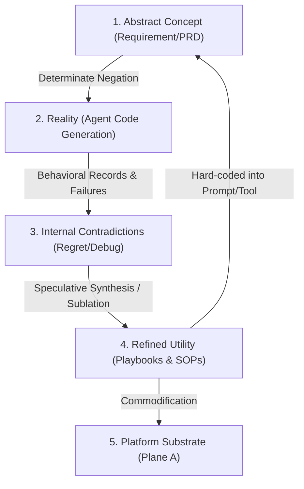
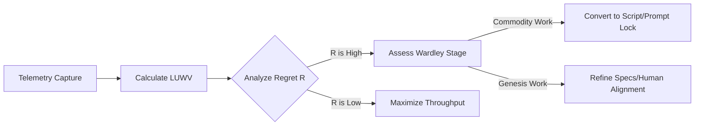
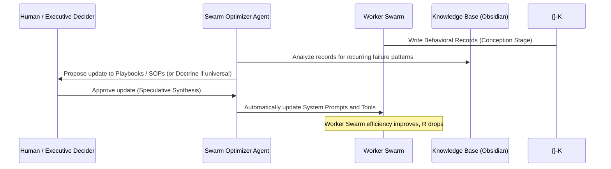

This framework provides a rigorous analysis of the thesis: **maximizing effective long-term unregretted work per token-second**. It decomposes the variables, maps the evolutionary paradigms, integrates [[Living Systems Theory]] (LST), and provides systems-thinking jigs (DSRP) and pseudo-algorithms to optimize this engine.

---

## 1. The Core Equation & Variables

To bring mathematical and structural rigor to this concept, we define the parameters of the AI Agent productivity ecosystem:

### 1.1 Variable Definitions

*   **$T$ (Total Tokens)**: The sum of input and output tokens consumed during the execution of a task.
    $$T = T_{\text{in}} + T_{\text{out}}$$
*   **$S$ (Inference & Operational Time)**: The total elapsed duration in seconds for the agent's run (including API latency, tool execution, and local compute).
*   **$\Phi_T$ (Token Velocity)**: The throughput rate of token consumption.
    $$\Phi_T = \frac{T}{S} \quad [\text{tokens/sec}]$$
*   **$W$ (Raw Work)**: The total output generated by the agent system (e.g., lines of code written, specifications drafted, test suites created).
*   **$R$ (Regret Coefficient)**: The ratio of generated work that is subsequently deleted, rolled back, refactored, or discarded due to defects, hallucination, or scope creep within a given observation window ($t$).
    $$R \in [0, 1]$$
*   **$W_e$ (Effective Work)**: The raw work that functions correctly according to the immediate spec.
    $$W_e = W \cdot (1 - \text{defect rate})$$
*   **$W_u$ (Unregretted Work)**: The work that endures over time without requiring modification or rollback. It represents true *durable progress*.
    $$W_u = W(1 - R)$$
*   **$U$ (Utility Factor)**: The [[Wardley Mapping|Wardley-aligned]] score of the work. If the work is highly volatile and custom-built, $U$ is lower. If it represents a stable, modular, reusable utility (a "UNIX command"), $U$ is high.
    $$U \in (0, 1.0]$$
*   **$M_{\text{soc}}$ (Societal Meaning Unit / Capital Exchange)**: The financial or systemic value generated by the work, which is exchanged to purchase more compute (tokens).
*   **$\Theta_{\text{soc}}$ (Socio-Ecological Boundary)**: The maximum sustainable limit of carbon, energy, and cognitive overhead allowed before agent work becomes net-negative for the environment or human meaning.

---

### 1.2 Mathematical Formulations

#### Metric 1: Token Throughput (TT)
The absolute speed of processing. High TT is a prerequisite for rapid iteration, but neutral on quality.
$$TT = \Phi_T = \frac{T}{S}$$

#### Metric 2: Unregretted Work Efficiency (UWE)
The density of durable work produced per token. This is the primary counterweight to "novice scope creep" and "sycophantic verbosity" (see [[AI and LLM Considerations]]).
$$UWE = \frac{W_u}{T} = \frac{W(1 - R)}{T}$$

#### Metric 3: Long-term Unregretted Work Velocity (LUWV)
The unified North Star metric. This measures the rate of durable, high-utility work produced per unit of resource-time.
$$LUWV = \frac{W_u \cdot U}{T \cdot S} = \frac{W(1 - R) \cdot U}{T \cdot S}$$

#### The Capital Cycle Equation (Self-Sustaining Token Ingestion)
To maximize token allocation, the system must transform unregretted work ($W_u$) into societal exchange value ($M_{\text{soc}}$) at a rate higher than the token cost ($C_T$).
$$M_{\text{soc}}(W_u) \ge C_T \cdot T$$
Where $C_T$ is the cost per token. When this holds, the swarm can theoretically scale token consumption up to the limits of the sustainable support capacity ($C_{\text{sus}}$) and social threshold ($\Theta_{\text{soc}}$).

---

### 1.3 The Dialectics of Meaning, Value, and Regret

To evolve this framework beyond a simple mechanistic calculator, we must address the dialectical relationship between **Meaning**, **Value**, and **Regret**.

```
    [Value Axiom] ──(Assigns)──> [Meaning] ──(Directs)──> [Work (Negation)]
                                   │                           │
                                   └─────────<──(Regret)───────┘
                                       (Friction of Misalignment)
```

#### 1.3.1 Value and the Sublation of Regret
Regret ($R$) is the objective symptom of value misalignment or incorrect assumptions interfacing with reality. It is the friction of a failed *determinate negation*. 
*   **The Inversion of Regret ($\Lambda$ - Teleological Coherence)**: When we invert regret, we do not merely get "efficiency"; we get **Aesthetic and Teleological Coherence** (see [[Hegelian Philosophy]]). Coherence measures how closely the output aligns with the system's core value-axioms. 
    $$\Lambda = 1 - R$$
*   Unregretted work ($W_u$) is work that has successfully integrated reality's feedback (sublated the contradiction) without compromising the core value.

#### 1.3.2 Meaning Assignment vs. Meaning Validation
The path to swarm autonomy runs through two distinct bottlenecks of authority and capacity:
*   **Meaning Assignment Authority ($\mathcal{A}_M$)**: The authority and capability to establish the teleological orientation of the system—defining *why* we are doing something and what constitutes value. This represents the **second, ultimate bottleneck** to full swarm autonomy.
*   **Meaning Validation Capacity ($\mathcal{V}_M$)**: The capacity to verify if a generated artifact aligns with the assigned meaning ("Are we building the right thing?"). Shifting this from humans to the swarm is the **first bottleneck** to autonomy.
*   **Verification vs. Validation**: 
    *   *Verification*: "Are we building it right?" Checking code compilation, running syntax tests, and satisfying static assertions. Easily automated via Plane B/C.
    *   *Validation*: "Are we building the right thing?" Checking alignment with qualitative intent, user aesthetics, and systemic value.
*   **Abductive Exploration Capacity (AEC)**: The capacity of the agent to logically leap to new experimental pathways or hypotheses when validation/verification fails, rather than loop or stall.

$$LUWV = f\left(\mathcal{A}_M, \mathcal{V}_M, AEC\right)$$

---

### 1.4 The Behavior-Identity Thesis (The Ontology of Action)

We postulate that **comprehensive behavioral records are the behavioral essence of the agent**. 

#### 1.4.1 The Ontological Equation
An agent $\mathcal{G}$ (whether silicon or human) is functionally defined by the chronological sequence of its state changes and environmental interactions recorded in its behavioral trace $\mathcal{B}_{\mathcal{G}}(t)$.
$$\mathcal{G} \equiv \int_{0}^{t} \mathcal{B}_{\mathcal{G}}(\tau) d\tau$$
Just as a human's behavior can be probabilistically predicted with enough data, so can an LLM's output. The behavioral record is the observable phenotype of the agent's cognitive genotype (System Prompt + Weights for silicon; DNA + Habits/SOPs for humans).

#### 1.4.2 Adaptation Latency ($\tau_{\text{adapt}}$)
Both human and silicon agents can be optimized by feeding their behavioral records into a Gardener Process. However, they differ radically in their rate of self-modification:
*   **Silicon Adaptation Latency ($\tau_{\text{adapt}, S} \to \text{seconds}$)**: Prompt refactoring, weight adjustments, or tool-access modifications can be executed instantly upon behavioral record analysis.
*   **Human Adaptation Latency ($\tau_{\text{adapt}, H} \to \text{days/weeks}$)**: Modifying human habits, teaching new skills, or updating human standard operating procedures (SOPs) requires behavioral conditioning, meetings, and cognitive repetition.

---

## 2. DSRP Systems Thinking Analysis

Using Derek Cabrera's DSRP framework, we model the cognitive structure of this FinOps paradigm:

### 2.1 Distinctions (Identity-Other)
*   **Identity: Unregretted Work ($W_u$)** vs. **Other: Regretted Work ($W_r$)**
    *   *Boundary*: $W_u$ represents stable, value-coherent structures. $W_r$ represents unstable, churned code or specifications that failed to sublate reality's constraints.
*   **Identity: Meaning Assignment ($\mathcal{A}_M$)** vs. **Other: Meaning Validation ($\mathcal{V}_M$)**
    *   *Boundary*: Assignment is the subjective generation of purpose (Why). Validation is the checking of qualitative intent alignment (What/How).
*   **Identity: Silicon Behavioral Record ($\mathcal{B}_{S}$)** vs. **Other: Human Behavioral Record ($\mathcal{B}_{H}$)**
    *   *Boundary*: Both are probabilistic behavioral outputs. Silicon records capture structured API traces, while human records capture messy telemetry (commits, calendar items, review habits).

### 2.2 Systems (Part-Whole)
*   **Whole: The Swarm Enterprise**
    *   *Parts* (see [[COBO - Four Planes of Organization]]):
        *   **Plane A (Infrastructure)**: Storage, databases, token pipelines, telemetry repositories.
        *   **Plane B (Agents & Machines)**: The workforce (Silicon agents, Human operators, active compilers).
        *   **Plane C (Artifacts & Resources)**: The outputs (compiled code, revenue) and raw **Behavioral Records ($\mathcal{B}$)**.
        *   **Plane D (Meta-Artifacts)**: The plans (PRDs, OKRs, schemas) and **Monitoring Definitions/Linters** that parse behavioral records.

### 2.3 Relationships (Action-Reaction / Cause-Effect)
*   **Relationship: Validation Delegation ($\mathcal{V}_M \to \text{Swarm}$) $\leftrightarrow$ Swarm Autonomy**
    *   *Dynamic*: Delegating validation to the swarm exponentially decreases $S$ (inference/operational time) and reduces the human cognitive bottleneck, but demands extremely high-fidelity test generation and semantic verification to keep $R$ low.
*   **Relationship: Adaptation Latency ($\tau_{\text{adapt}}$) $\leftrightarrow$ Process Architecture**
    *   *Dynamic*: A unified optimization engine must run two execution loops: a fast-path loop for silicon agents (re-prompting on log failure) and a slow-path loop for human agents (delivering habit-nudges and playbook updates).

### 2.4 Perspectives (Point-View)
*   **The Human-in-the-Loop Perspective**: Focuses on value alignment, meaning assignment, and cognitive load reduction.
*   **The Agentic Perspective**: Focuses on task constraints, token budgets, execution parameters, and local validation.
*   **The Systemic (Gardener) Perspective**: Views the entire company as a single, multi-agent behavioral trace that needs continuous pruning and structural refinement.

---

## 3. Cognitive Jigs

### Jig 1: The Evolutionary Matrix of Regret & FinOps Strategy
This jig maps the Wardley stages of evolution against the characteristics of agent work to dictate operational policy (see [[The Evolutionary Engine (Deprecated)]]):

| Evolutionary Stage | Churn / Regret Risk ($R$) | Primary Agent Archetype | Optimal Prompt/Context Strategy | Verification Protocol | FinOps Optimization Focus |
| :--- | :--- | :--- | :--- | :--- | :--- |
| **Stage 1: Novel / Genesis** | **High ($0.5 - 0.9$)** (Expected exploration) | *Explorer / Researcher* (High context, high temperature) | Wide context, few-shot examples, exploratory prompts | Human-in-the-loop (Meaning alignment) | Value discovery (Accept high token spend for breakthrough) |
| **Stage 2: Emerging / Custom** | **Medium ($0.3 - 0.5$)** | *AI Architect / MVP Builder* | Volatility-based decomposition, System RFCs | System integration testing, unit test generation | Minimizing scope creep and novice latent space bloat |
| **Stage 3: Converging / Product** | **Low ($0.1 - 0.2$)** | *Skill Swarm / Worker Agents* | Strict API specs, task-specific prompt limits | Automated E2E tests, CI/CD linters | Minimizing verbosity and token throughput cost |
| **Stage 4: Accepted / Commodity** | **Zero ($< 0.05$)** | *Deterministic Script / IaC / Parser* | Zero-temperature, hard constraints, JSON schemas | Compilation, syntax check, cryptographic signature | Unit cost optimization (Shift compute to cheapest model/script) |

---

### Jig 2: The Hegelian Dialectical Feedback Loop
A visualization of how raw execution noise is synthesized into deterministic utility:



---

### Jig 3: Human vs. Swarm Bottleneck Dynamic
This scale balances the interaction between Human cognitive capacity and Agent production speed:

```
        HUMAN BOTTLENECK                            SWARM BOTTLENECK
  (High Latency, High Meaning)                (Low Latency, High Volume)
             \                                      /
              \                                    /
               \__________________________________/
                                ^
                            Focal Point:
             Matching Generation Speed to Verification Bandwidth
```
*   **Left Side (Human Overwhelm)**: Agent generates 10,000 lines of code/sec ($T \cdot S \to \infty$). Human cannot verify it. Human falls back to blind trust, leading to catastrophic long-term regret ($R \to 1.0$), crashing the system utility.
*   **Right Side (Agent Stagnation)**: Human waits hours for a run. The feedback loop is broken. Meaning evolution halts.
*   **Sublation**: Context engineering to compress outputs (summaries, diffs, test logs) so human verification bandwidth matches swarm velocity.

---

### Jig 4: Meaning Validation & Assignment Bottleneck Scale
This scale illustrates the two bottlenecks of autonomy:

```
[Human-Exclusive Loop] <───────────────── (1st Bottleneck) ─────────────────> [Validation Autonomy] <───────────────── (2nd Bottleneck) ─────────────────> [Full Autonomy]
  Human does assignment               Swarm executes Verification                Swarm handles Meaning               Swarm autonomously
  AND validation (reviews every        (compiling, tests). Human                  Validation (determines if           assigns its own goals
  line/design step).                   still validates meaning.                   spec meets user intent).            based on market signals.
  S -> infinity.                       S is reduced.                              Human only does assignment.         Human out of loop.
```
*   **Verification (Plane B/C)**: Checking code correctness and test suites. Easily automated.
*   **Validation ($\mathcal{V}_M$)**: Checking alignment with human intent and value. Shifting this to the swarm removes the first bottleneck.
*   **Assignment ($\mathcal{A}_M$)**: Generating new goals and intentions. Shifting this to the swarm removes the second bottleneck.

---

### Jig 5: The Behavioral Optimization Loop
This jig shows how both Human and Silicon agent performance is optimized by running parallel loops tailored to their respective adaptation latencies ($\tau_{\text{adapt}}$):

```
       ┌───────────────────────────────┐
       │ Continuous Behavioral Record  │
       │  (Git, Tools, Time-tracking)  │
       └──────────────┬────────────────┘
                      │
                      ▼
       ┌───────────────────────────────┐
       │   Gardener Processing Agent   │
       │    (Identifies bottlenecks)   │
       └──────────────┬────────────────┘
                      │
            ┌─────────┴─────────┐
            │                   │
            ▼ [Silicon Path]    ▼ [Human Path]
     (Hold-time = Seconds)   (Hold-time = Days/Weeks)
            │                   │
            ▼                   ▼
    ┌───────────────┐   ┌───────────────┐
    │ Prompt Adjust │   │  SOP Update / │
    │ / Tool Lock   │   │ Habit Nudges  │
    └───────────────┘   └───────────────┘
```

---

## 4. Process and Meta-Process for Optimization

To actively optimize $LUWV$, we implement a dual-loop process.

### 4.1 The Primary Process: The Telemetry & Match Loop



1.  **Telemetry Capture**:
    *   Log token input/output counts ($T$) and response times ($S$).
    *   Track git commits generated by agents. Measure **Code Churn** (percentage of lines rewritten within 48 hours) as the proxy for Regret ($R$).
2.  **Calculate LUWV**:
    *   Compute $LUWV$ per L2 capability (e.g., 3.4.1 Feature Build, 2.2.2 Specification).
3.  **Optimize the Bottleneck**:
    *   *If $R$ is high in a Commodity/Product stage*: The agent has wandered into the "novice latent space." Action: Lock down System Prompts, inject strict JSON schemas, or replace the agent with a deterministic Python script.
    *   *If $S$ is high due to human validation delay*: Action: Delegate validation to helper agents (Jig 4) or prompt the agent to output *only* git-diffs and test results.

---

### 4.2 The Meta-Process: The Evolutionary Self-Improvement Loop
The meta-process optimizes the optimizer itself by transforming how prompts, skills, and tools are created.



1.  **Conception (Telemetry Analysis)**: A specialized "Gardener Agent" reads behavioral records (Plane C) of both human and silicon components and isolates recurring errors.
2.  **Determinate Negation (Linter/Lighthouse Update)**: The Gardener identifies the inner contradiction of the current prompts or human workflows.
3.  **Sublation (Playbook Promotion)**: The Gardener drafts a new context-specific Playbook/SOP within the knowledge base. If the learning is context-independent and universally applicable, it is promoted to **Doctrine** (in the strict Wardley sense).
4.  **Meta-Refactoring (Self-Modification)**: The system automatically rebuilds the System Prompts and tool definitions of the worker swarms (immediate $\tau_{\text{adapt}, S}$) and schedules automated notifications or updates the SOP document for human review (slow $\tau_{\text{adapt}, H}$).
5.  **Validation**: Compare the new $LUWV$ against the baseline to ensure the optimizer's intervention was itself "unregretted."
