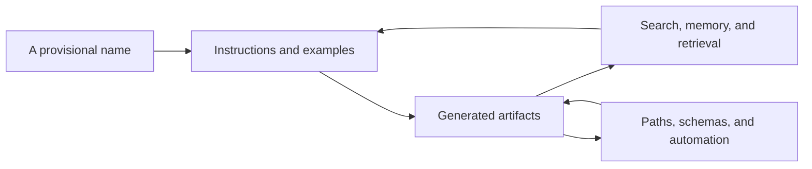
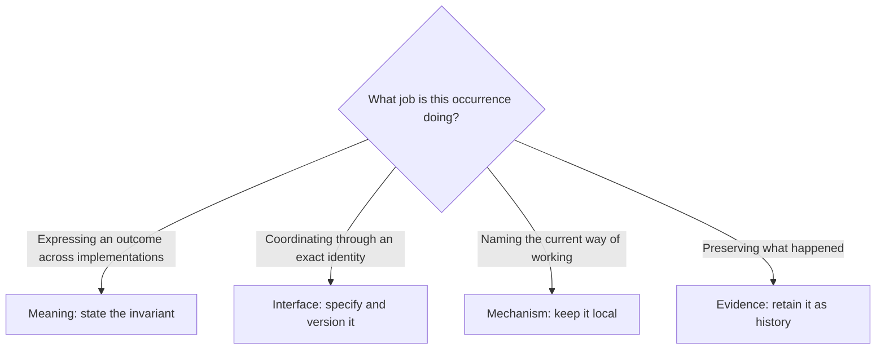
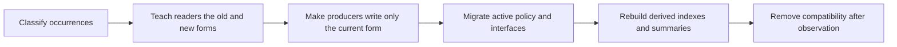

A team gives a useful practice a name. The name enters a guide, then a template, then a directory. A script begins looking for the directory. Dashboards count the artifacts inside it. New people learn the term during onboarding. Agents encounter it in their instructions and reproduce it in every plan they write.

Months later, the practice has changed. The old name no longer fits, but replacing it feels strangely dangerous. Nobody can tell which appearances are descriptive, which are historical, and which are load-bearing. The name did not prevail because anyone made a lasting decision about it. It prevailed by accumulating dependencies.

The result is more than a naming nuisance. It is architectural coupling.

The usual response is to reach for a glossary, a naming convention, or a repository-wide replacement. Each can help in a narrow case. None addresses the underlying mistake: allowing one expression to stand simultaneously for an enduring idea, a public interface, a temporary mechanism, and a historical fact.

The remedy is smaller than a vocabulary program. Give each occurrence of a name one job, and put it where that job belongs.

## How a word acquires weight

Words in a working system are not passive descriptions. They can select files, route requests, trigger automation, define permissions, and tell people what kinds of things are possible. In a system that uses language models, prose can also become runtime context. An example in a guide may be copied into a plan; the plan becomes an artifact; the artifact is retrieved as precedent; the precedent shapes the next plan.



Repetition changes the practical status of the term. What began as shorthand starts to look like policy. What looked like policy becomes an interface. Soon the system cannot distinguish “this is how we currently do it” from “this is what must always be true.”

Language models quicken this cycle, but they did not invent it. People copy familiar templates too. Search engines rank what already exists. Scripts reward uniform strings. Institutional memory turns yesterday's implementation into today's common sense. Generative systems simply reduce the cost of reproduction and increase its range.

This is one reason context selection matters. Long prompts do not produce an impartial reading of everything they contain: performance varies with where relevant material appears, as the [“Lost in the Middle” study](https://aclanthology.org/2024.tacl-1.9/) demonstrated. One contemporary implementation, [Google's context engineering for ADK](https://developers.googleblog.com/architecting-efficient-context-aware-multi-agent-framework-for-production/), separates immediate working context, durable memory, and named artifacts instead of passing an undifferentiated history to every agent. The broader lesson is older: availability is not authority, and recurrence is not truth.

## A name is not a concept

The first distinction is almost embarrassingly simple: an idea and its current label are not the same thing.

Knowledge-representation systems make this separation explicit. The W3C's [SKOS model](https://www.w3.org/TR/skos-reference/) treats a concept as something that can have a preferred label, alternative labels, hidden labels, and labels in several languages. The concept supplies continuity; labels supply ways to refer to it.

Most project documentation collapses those layers. A preferred term becomes the folder name, the schema value, the title of a ritual, and the noun used in permanent policy. Changing the label then appears to change the concept, even when the intended outcome remains untouched.

The goal is not to strip language of concrete nouns. It is to stop asking one noun to carry several kinds of stability at once.

## The four jobs of a name

Rather than sorting words into approved and forbidden lists, classify each *occurrence* by the job it performs.

| Job | What it carries | When the exact name matters | Proper home |
|---|---|---|---|
| **Meaning** | A durable concept, outcome, or constraint | As a preferred label; the definition must be able to outlive it | Principles, domain rules, acceptance criteria |
| **Interface** | Coordination across a boundary | Yes; another person or system depends on the spelling or identity | Schemas, protocols, public paths, commands |
| **Mechanism** | The current way of accomplishing something | Only while that mechanism is in use | Its module, adapter, template, or local instructions |
| **Evidence** | What was said, chosen, or observed at a point in time | Yes; fidelity to the past matters | Logs, decisions, source material, archived artifacts |

This is an ontology of uses, not a universal dictionary. The same term may appear in all four roles. That is fine if the roles live in separate places. If one sentence or file performs several roles, the ambiguity is already telling you something about its design.



The categories are separated by their reason for change:

- Meaning changes when our understanding or purpose changes.
- An interface changes through coordination and migration.
- A mechanism changes when a better implementation becomes worthwhile.
- Evidence does not change merely because current practice did.

That separation follows the logic of information hiding. David Parnas argued that modules should conceal design decisions likely to change, rather than mirror the steps of a process. The same principle applies to vocabulary: a volatile implementation name should not leak into every durable rule that happens to use it. The [original paper](https://doi.org/10.1145/361598.361623) is more than half a century old; prose-driven systems make its advice newly visible.

## Name narrowly; specify broadly

A lightweight discipline follows from the four jobs.

Cross-cutting policy should say what must be true. Local instructions may say how the current system makes it true. Interfaces should name their exact symbols deliberately. Historical records should preserve the vocabulary that was actually used.

Suppose a system requires consequential choices to remain reviewable. The durable rule is not “create one of our standard decision documents.” It is closer to:

> Record consequential choices with their context, alternatives, consequences, status, and supersession path.

The exact artifact name, filename pattern, template, and tool belong with the mechanism that implements the rule. If that mechanism is public or machine-addressed, its precise identifiers also form an interface and deserve versioning.

A useful editing question is the **swap test**:

> If the current tool, template, or process were replaced tomorrow, would this sentence still be true?

If yes, the sentence probably belongs to the meaning layer and should not depend on the implementation's proper name. If no, place it near the mechanism or interface it describes.

This does not require a grand terminology service. Often the whole design is one stable rule plus one local mapping:

```text
Durable rule: Preserve the basis and consequences of significant choices.
Local mechanism: In this repository, the `decisions/` workflow satisfies that rule.
```

The mapping is allowed to expire. The rule is not forced to expire with it.

Boundaries also matter. Eric Evans's [Domain-Driven Design reference](https://www.domainlanguage.com/ddd/reference/) treats a model and its language as valid within a bounded context. One part of a system does not need to surrender its precise local vocabulary merely because another part uses a different model. Translation at a boundary is often cheaper and more honest than imposing a single term everywhere.

## Retiring a sticky term

Once a term has spread, indiscriminate replacement is risky. A search result may be an active instruction, a public identifier, a quotation, or an accurate record of an old decision. Those occurrences need different treatment.

A safe migration moves in one direction:



1. **Classify before editing.** Mark each occurrence as meaning, interface, mechanism, or evidence. Also identify the producers: templates, instructions, generators, copied examples, and automation.
2. **Stop new production.** Update the places that emit the old term before cleaning up their output. Otherwise the corpus grows back.
3. **Migrate active surfaces.** Change current policy, navigational paths, and interfaces deliberately. Where compatibility matters, let readers understand both forms while writers emit only the new one. Martin Fowler describes this general expand-and-contract pattern as [parallel change](https://martinfowler.com/bliki/ParallelChange.html).
4. **Preserve honest history.** Do not rewrite quotations, logs, or past decisions as if the new vocabulary had always existed. Add status or a supersession note when an old record might be mistaken for current guidance. The W3C's OWL reference uses the same basic distinction: deprecated terms remain available for backward compatibility but [should not be used in new documents](https://www.w3.org/2001/sw/WebOnt/TR/STAGE-owl-ref/).
5. **Refresh the echoes.** Regenerate indexes, summaries, examples, search aliases, and retrieval stores. A source edit is incomplete when derived context continues teaching the old term.

The final check is behavioral, not cosmetic: can current producers still emit the retired label, and can current readers correctly interpret the records that retain it?

## What not to build

The cure can become its own accretion problem.

A universal glossary sounds tidy, but it often centralizes arguments that are genuinely local. A ban on proper nouns makes instructions vague. A blind replacement damages evidence and hidden interfaces. Permanent dual terminology makes every reader pay the migration cost forever. A custom linter for the first naming mistake costs more than the mistake.

Use the smallest control that matches the failure:

- Put a durable rule at the narrowest shared level that needs it.
- Put concrete mappings beside the mechanisms they name.
- Declare exact names only where interoperability requires them.
- Preserve historical language with visible status.
- Automate detection only after a repeated, mechanical failure is clear.

The aim is not semantic purity. It is cheap change.

## The deeper habit

Names help us see. They make a practice discussable and a boundary operable. Trouble begins when familiarity is mistaken for permanence.

A healthy system can answer four questions about any important term: What meaning does it preserve? Which boundary depends on its exact form? Which mechanism currently bears the name? Which records must retain it? If those answers are separable, the vocabulary can evolve without erasing history or rewiring the whole system.

A good name need not last forever. Its eventual replacement should be ordinary.
