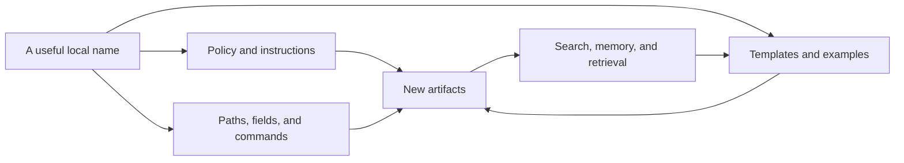
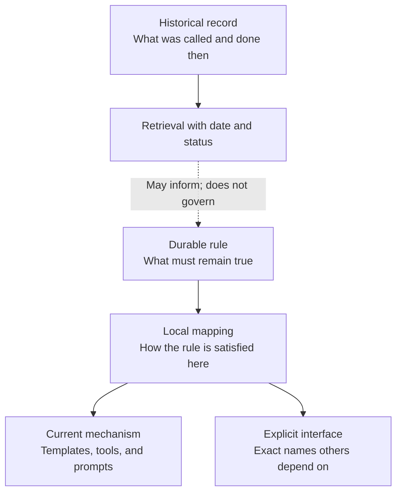

The first sign that a name has become architecture is an unexpectedly frightening search result.

Suppose a team prepares a “review packet” before any risky release. The packet began as a document: a convenient bundle of test results, open questions, and rollback notes. The name was ordinary and useful. People knew what to ask for.

A few years later, the release process has changed. Evidence now accumulates continuously in tests and deployment systems, so nobody needs to assemble a packet. An engineer volunteers to retire the old template, searches the repository for *review packet*, and finds hundreds of matches.

Some are harmless. Old release notes say which packet was approved. Others are less so. A policy requires every release to have one. A database records `packet_complete`. A bot refuses to deploy without that field. Agent instructions contain three examples of how to create a packet, and generated plans have copied the phrase into projects that never used the original document.

The engineer thought she was removing a template. She has found a protocol.

A name becomes architecture when changing the word changes the behavior of the system.

## A noun can become a dependency

We are accustomed to thinking of dependencies as technical things: libraries, APIs, database tables, service contracts. Words feel softer. They live in documents, and documents are easy to edit.

But a working vocabulary does more than describe the system. It tells people what objects exist. It supplies filenames and status values. It appears in permissions, search queries, dashboards, and training material. Each use makes the term a little more necessary. Eventually the name is no longer attached to one implementation; it is the handle by which many parts of the system coordinate.

The review packet did not spread because anyone decided that packets were a permanent feature of release engineering. It spread because the term was useful at each local step. The policy writer borrowed it from the template. The bot author borrowed it from the policy. Later writers borrowed it from both. Local consistency produced global rigidity.

None of this requires AI. People copy old documents. Search favors the vocabulary already present. Metrics reward stable categories. Language models change the rate and reach of reproduction.

An old handbook might once have misled the occasional reader. Now its language can be retrieved at the moment of action and used to generate another plan, another file, another instruction. A model does not know that a frequently retrieved phrase is merely conventional, or that an archived document has lost authority, unless the surrounding system makes those distinctions visible. Repetition can look like importance; availability can look like endorsement.

Long context does not solve this. Models use different parts of a long prompt with uneven reliability, as the [“Lost in the Middle” experiments](https://aclanthology.org/2024.tacl-1.9/) showed. One response is to separate immediate working context from durable memory and stored artifacts, as in [Google's description of context handling in ADK](https://developers.googleblog.com/architecting-efficient-context-aware-multi-agent-framework-for-production/). A smaller, deliberately assembled context helps. It still leaves a prior question: what did we allow the stored material to mean?

## The name and the thing

The review packet was never the real requirement. The team needed enough evidence to judge a risky release, a responsible owner, and a credible way back if the change failed. For a time, one document gathered those things. Later, other machinery could satisfy the same need.

Calling the document a packet was harmless. Making *packet-ness* the only legible form of readiness was expensive.

Knowledge representation has a clean way to express this distinction. The W3C's [SKOS model](https://www.w3.org/TR/skos-reference/) treats a concept as something that may have a preferred label, alternate labels, and labels in several languages. The concept has continuity even when its preferred expression changes. That sounds academic until a folder name, schema value, and prompt all insist that one expression *is* the concept.

Software architecture has long offered the corresponding design rule. David Parnas argued that a module should hide a decision likely to change. Information hiding keeps one volatile choice from forcing unrelated parts of a system to change with it. His [1972 paper on modular decomposition](https://doi.org/10.1145/361598.361623) concerned software, but the rule travels well. An implementation name is also a decision likely to change.

Had the original policy said, “Preserve reviewable evidence before a high-risk release,” the team could have changed its method without changing its purpose. A local instruction could then say, “The review packet is how we currently satisfy this rule.” One sentence belongs to the system's durable intent. The other belongs beside the mechanism it names.

That small separation is most of the solution.

## Give every name an address

Banning concrete names would make the system harder to use. A tool needs a command. A schema needs a field. Colleagues need a shared phrase. Vague language would only trade one problem for another.

Each exact name needs an address and a reason to live there.

A durable rule should describe the condition the system must preserve. The current implementation should be named close to the template, tool, or workflow that owns it. If another component depends on an exact spelling such as `packet_complete`, that spelling is an interface: publish it, version it, and migrate it deliberately. Old release records should keep the language used at the time because their job is to report what happened, not pretend the present existed in the past.

These are different reasons for keeping a word. Mixing them in one document gives the word several incompatible lifetimes.

There is a quick way to catch leakage before it spreads. Read a policy sentence and imagine replacing the current tool, template, or ritual tomorrow. Would the sentence remain true?

If it would, the proper name probably does not belong in the policy. Keep the invariant there and move the concrete mapping closer to the implementation. If the sentence would become false, find out why. Perhaps the name is genuinely contractual. Perhaps the policy has quietly become a user manual. Either answer is useful because it reveals what kind of change you are actually making.

The “swap test” needs no central dictionary or approved vocabulary for every noun. It asks whether a temporary choice has escaped its natural boundary.

Boundaries spare us from chasing a universal language. A term can be precise and useful inside one area without becoming mandatory everywhere else. Eric Evans's [Domain-Driven Design reference](https://www.domainlanguage.com/ddd/reference/) makes this point through bounded contexts: a model and its language have a domain of validity. Translation at a boundary is often cheaper than forcing every part of a system to share one model.

## Changing a word that is already everywhere

Once a term has spread, global search and replace is tempting. It is also the moment when careful distinctions matter most.

The search results for *review packet* contain several kinds of fact. A current prompt may cause new packets to be written. A schema field may be consumed by another service. An old approval record may need to retain the phrase forever. Changing all three identically would either break the system or falsify its history.

The order of migration matters.

1. **Find the writers.** Templates, examples, generators, prompts, and automation keep the old vocabulary alive. Change them first. Cleaning their output while leaving the producers untouched is gardening in a windstorm.
2. **Let readers understand both forms.** During the transition, accept the old and new names at genuine boundaries while emitting only the new one. This is the ordinary expand-and-contract sequence Martin Fowler calls [parallel change](https://martinfowler.com/bliki/ParallelChange.html).
3. **Move active policy and interfaces.** Rewrite current rules around the durable condition. Rename fields, paths, and commands through an explicit compatibility window rather than pretending they are prose.
4. **Leave honest records alone.** A release approved under the review-packet process should continue to say so. Add a date, status, or supersession note when old material might be mistaken for current instruction. The W3C's OWL reference takes a similar approach to deprecated vocabulary: old identifiers can remain for compatibility but [should not appear in new documents](https://www.w3.org/2001/sw/WebOnt/TR/STAGE-owl-ref/).
5. **Rebuild the echoes.** Search indexes, summaries, embeddings, cached examples, and generated guidance may continue teaching the retired term after every source file is correct. Derived context needs regeneration too.

Only then is it safe to remove compatibility. The useful test is behavioral: current writers no longer produce the old term, current readers understand the records that retain it, and no external consumer still relies on the retired interface.

## Do less than a terminology program

This problem invites an impressively bureaucratic cure. Build a canonical glossary. Appoint owners for every term. Add a linter. Require every document to declare its vocabulary version.

Sometimes a regulated or highly integrated system needs that machinery. Most teams do not. A universal glossary can freeze local distinctions, while a linter will faithfully enforce whatever misunderstanding happened to be encoded first. The attempt to control accretion becomes another source of it.

Start smaller. Write shared rules in terms of outcomes and constraints. Keep implementation names near their owners. Mark historical material so that retrieval can distinguish precedent from current authority. Add automation only when the same mechanical failure has happened often enough to justify it.

Return to the frightening search result. It still contains hundreds of matches, but they no longer form one undifferentiated problem. After the migration, old release notes will still mention review packets, as they should. The bot will accept the new evidence field. Current prompts will speak the current language. Nothing has been purged; authority has been sorted.

A system remains free to change when its permanent rules do not speak in the names of temporary things.
